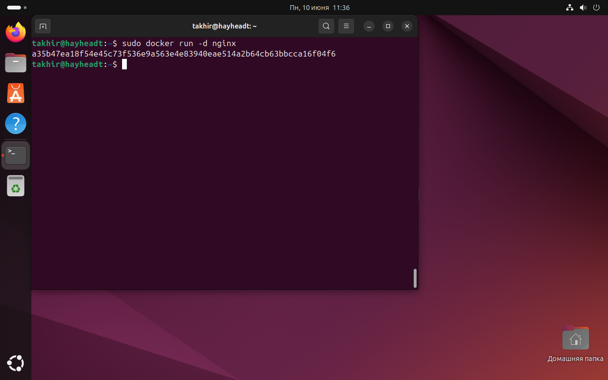
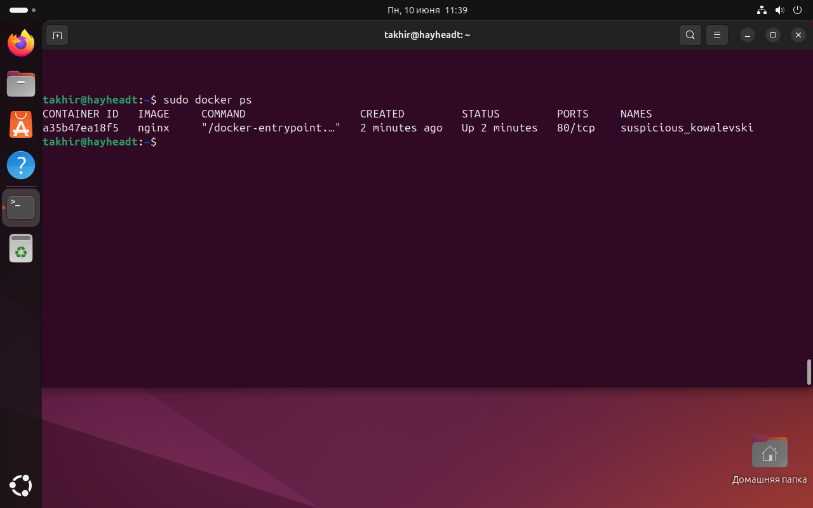
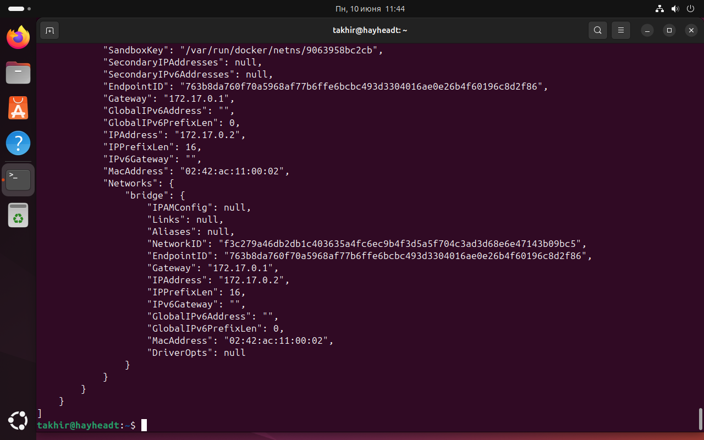
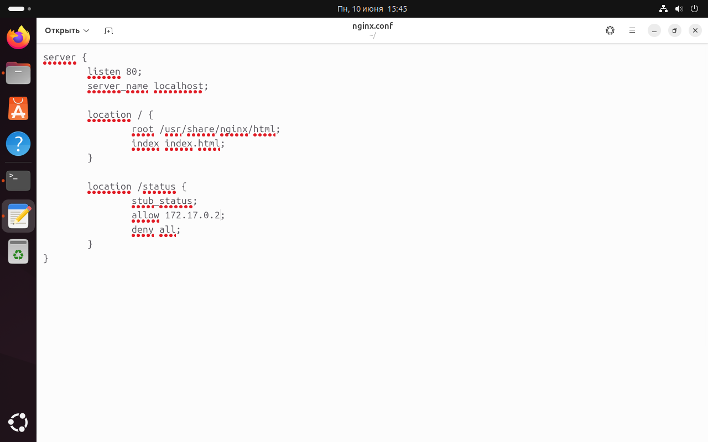

## Part 1. Готовый докер

- Взял официальный докер-образ с nginx и выкачал его при помощи docker pull.
;

- Проверил наличие докер-образа через docker images.
;

- Запустил докер-образ через docker run -d [image_id|repository].
;

- Проверил, что образ запустился через docker ps.
;

- Посмотрел информацию о контейнере через docker inspect [container_id|container_name].
;
;

- По выводу команды определил и поместил в отчёт размер контейнера, список замапленных портов и ip контейнера.
;
;
;

- Остановил докер образ через docker stop [container_id|container_name].
;

- Проверил, что образ остановился через docker ps.
;

- Запустил докер с портами 80 и 443 в контейнере, замапленными на такие же порты на локальной машине, через команду run.
;
;

- Проверил, что в браузере по адресу localhost:80 доступна стартовая страница nginx.

- Перезапустил докер контейнер через docker restart [container_id|container_name].
;

- Проверил, что контейнер запустился.
.

## Part 2. Операции с контейнером

- Прочитал конфигурационный файл nginx.conf внутри докер контейнера через команду exec.
;

- Создал на локальной машине файл nginx.conf.
;

- Настроил в нем по пути /status отдачу страницы статуса сервера nginx.

- Скопировал созданный файл nginx.conf внутрь докер-образа через команду docker cp.
;

- Перезапустил nginx внутри докер-образа через команду exec.
;

- Проверил, что по адресу localhost:80/status отдается страничка со статусом сервера nginx.
;

- Экспортировал контейнер в файл container.tar через команду export.
;

- Остановил контейнер.
;

- Удалил образ через docker rmi [image_id|repository], не удаляя перед этим контейнеры.
;

- Удалил остановленный контейнер.
;

- Импортировал контейнер обратно через команду import.
;

- Запустил импортированный контейнер.
;

- Проверил, что по адресу localhost:80/status отдается страничка со статусом сервера nginx.
.

## Part 3. Мини веб-сервер

- Написал мини-сервер на C и FastCgi, который будет возвращать простейшую страничку с надписью Hello World!.
;
;
;

- Запустил написанный мини-сервер через spawn-fcgi на порту 8080.
;
;
;

- 

 

