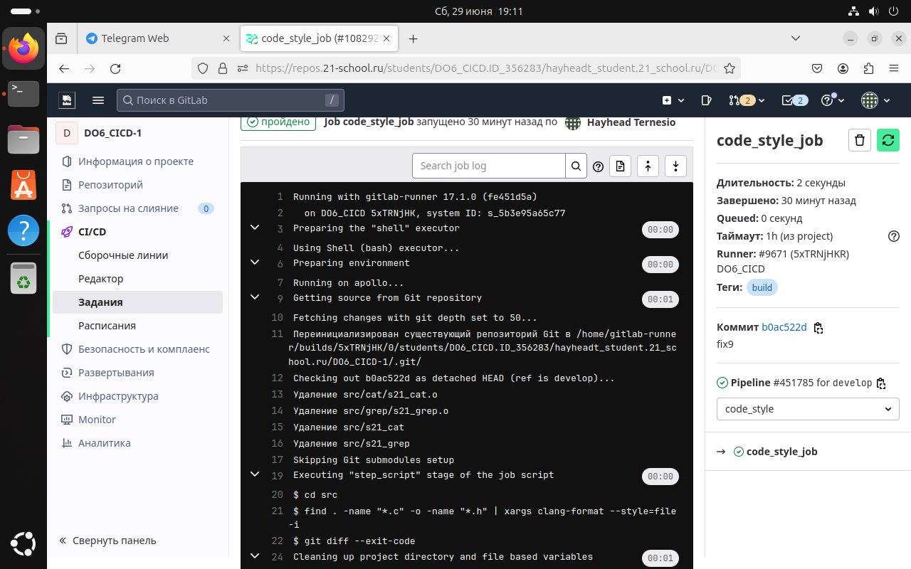
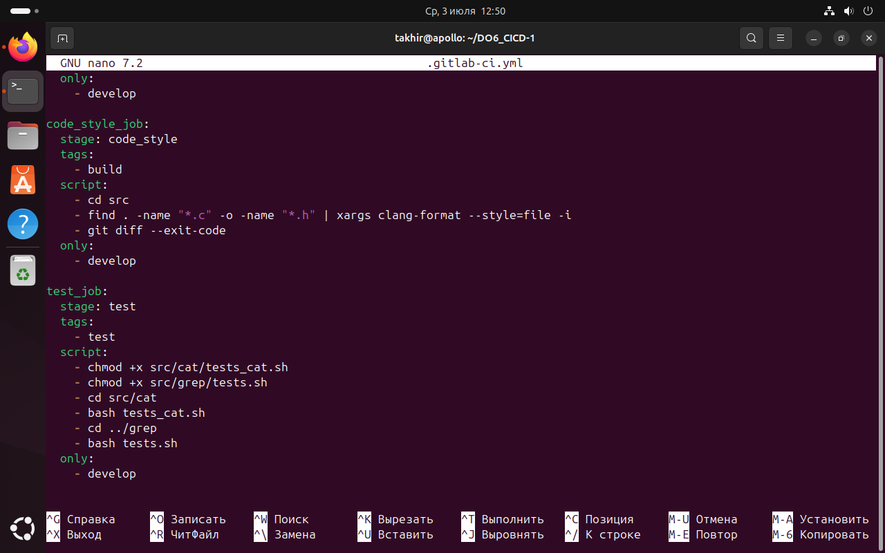
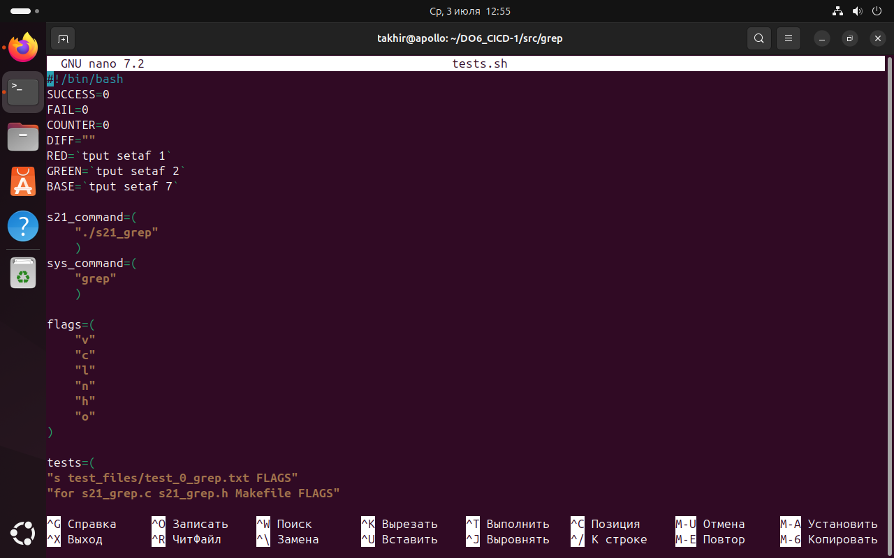

## Part 1. Настройка gitlab-runner

- Поднял виртуальную машину Ubuntu Server 22.04 LTS.

- Скачал и установил на виртуальную машину gitlab-runner.
    1) выполнил команду: <br>
    ```sh
    sudo curl -L --output /usr/local/bin/gitlab-runner https://gitlab-runner-downloads.s3.amazonaws.com/latest/binaries/gitlab-runner-linux-amd64
    ```
    

    2) выполнил команду: <br>
    ```sh
    sudo chmod +x /usr/local/bin/gitlab-runner
    ```
    

    3) выполнил команду: <br>
    ```sh
    sudo useradd --comment 'Gitlab Runner' --create-home gitlab-runner --shell /bin/bash
    ```
    

    4) выполнил команду: <br>
    ```sh
    sudo gitlab-runner install --user=gitlab-runner --working-directory=/home/gitlab-runner
    ```
    

    5) выполнил команду: <br>
    ```sh
    sudo gitlab-runner start
    ```
    

    6) выполнил команду: <br>
    ```sh
    sudo chown gitlab-runner:gitlab-runner /home/gitlab-runner
    ```
    

    7) выполнил команду: <br>
    ```sh
    sudo chmod 700 /home/gitlab-runner
    ```
    

- Запустил gitlab-runner и зарегистрировал его для использования в текущем проекте (DO6_CICD).
    1) выполнил команду: <br>
    ```sh
    sudo gitlab-runner register
    ```
    

    2) выполнил команду: <br>
    ```sh
    sudo gitlab-runner list
    ```
    


## Part 2. Сборка

- Написал этап для CI по сборке приложений из проекта C2_SimpleBashUtils.

    1) Сначала SSH-ключ;
    
    2) Cклонировал проекты C2_SimpleBashUtils и DO6_CICD;

    

    
    
    3) Скопировал файлы с C2_SimpleBashUtils в DO6_CICD;
    
    

- В файле gitlab-ci.yml добавил этап запуска сборки через мейк файл из проекта C2.

    1) создал файл .gitlab-runner.ci.yml

    

- Файлы, полученные после сборки (артефакты), сохранил в произвольную директорию со сроком хранения 30 дней.

    
    
    1) Затем запушил в gutlab

    
    
    2) Проверил в gitlabe раздел CI/CD

    

    3) Посмотрел подробно об ошибке

    

    4) Затем посмотрел скрытые файлы

    

    5) Чтобы исправить ошибку, нужно открыть файл .bash_logout и закомментировать все незакомментированные строки

    

    

    6) Чтобы проверить результат, нужно в gitlabe в разделе CI/CD обновить Run pipeline

    

    7) можно посмотреть результат детально

    


## Part 3. Тест кодстайла

- Написал этап для CI, который запускает clang-format и завершает пайплайн с ошибкой, если кодстайл не прошел.

    1) Для этого нужно изменить файл .gitlab-ci.yml

    

    2) Нужно добавить файл .clang-format для настройки стиля кода

    

    3) После добавления этих файлов, дальше нужно запушить в gitlab

    4) Чтобы проверить результат, нужно в gitlabe перейти в раздел CI/CD

    

    5) можно посмотреть результат детально

    


## Part 4. Интеграционные тесты

- Написал этап для CI, который запускает мои интеграционные тесты из того же проекта.

    1) Для этого нужно изменить файл .gitlab-ci.yml

    

    2) Добавил скрипт в cat и grep

    

    

    3) Добавил тестовые файлы в cat и grep

    

    

    4) После добавления этих файлов, дальше нужно запушить в gitlab


- Запустил этот этап автоматически


- В пайплайне отобразил вывод, что интеграционные тесты успешно прошли


## Part 5. Этап деплоя

- Поднял вторую виртуальную машину Ubuntu Server 22.04 LTS.


- Написал этап для CD, который «разворачивает» проект на другой виртуальной машине.

    1) Изменил файл 

    

    2) Сохранил изменения

    

    3) Также изменил во второй машине такой же файл

    

    4) Сохранил изменения

    

    5) Проверил пинг между машинами

     

    

    6) Подключился ко второй машине по ssh

     


- В файле gitlab-ci.yml добавил этап запуска написанного скрипта.


- После всего этого, запушил в gitlab.


- Проверил результат deploy


## Part 6. Дополнительно. Уведомления

- Настроил уведомления о успешном выполнении пайплайна через бота с именем hayheadt DO6 CI/CD» в Telegram.

    1) Добавил в файле .gitlab-ci.yml  пункты

    

    2) Добавил скрипт

    

    3) С помощью бота настроил уведомление

    

    


